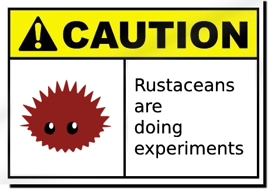

# wacker

Like Docker, but for WASM.



## Installation

You can download binaries directly from the [Releases](https://github.com/iawia002/wacker/releases) page.

Or you can install it using `cargo`:

```
cargo install wacker-daemon
cargo install wacker-cli
```

## Getting started

Start the wacker daemon:

```
$ wackerd
[2023-11-22 07:25:31 INFO wackerd] server listening on "/Users/user/.wacker/wacker.sock"
```

Run a WebAssembly program:

```
$ wacker run hello.wasm
$ wacker run time.wasm
```

Where `hello.wasm` is a simple WASM program that prints out `Hello World!` and exits, and `time.wasm` is a long-running program that constantly prints out the current time.

Serve an HTTP WebAssembly program:

```
$ wacker serve hello_wasi_http.wasm --addr 127.0.0.1:8081
```

List running programs:

```
$ wacker list
ID                        PATH                   STATUS     ADDRESS
hello-w0AqXnf             hello.wasm             Finished
time-xhQVmjU              time.wasm              Running
hello_wasi_http-luf1vz6   hello_wasi_http.wasm   Running    127.0.0.1:8081
```

Fetch the logs:

```
$ wacker logs hello-w0AqXnf
Hello World!

$ wacker logs -f --tail 5 time-xhQVmjU
current time: 2023-11-22 07:42:34
current time: 2023-11-22 07:42:35
current time: 2023-11-22 07:42:36
current time: 2023-11-22 07:42:37
current time: 2023-11-22 07:42:38
```

And you can also stop/restart/delete the program:

```
$ wacker stop time-xhQVmjU
$ wacker restart time-xhQVmjU
$ wacker delete/rm time-xhQVmjU
```

Usage for wacker cli:

```
$ wacker -h
wacker client

Usage: wacker <COMMAND>

Commands:
  run      Runs a WebAssembly program
  serve    Serves an HTTP WebAssembly program
  list     Lists running WebAssembly programs [aliases: ps]
  stop     Stops a WebAssembly program
  restart  Restarts a WebAssembly program
  delete   Deletes a WebAssembly program [aliases: rm]
  logs     Fetches logs of a program [aliases: log]
  help     Print this message or the help of the given subcommand(s)

Options:
  -h, --help     Print help
  -V, --version  Print version
```
